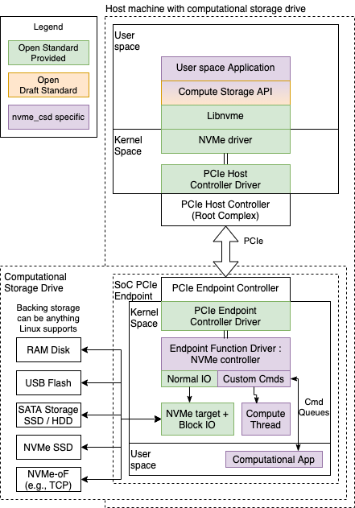

# NVMe CSD

**A Linux based Firmware for Hardware Agnostic NVMe Computational Storage Devices**

This project provides an open-source firmware to build hardware agnostive NVMe computational storage devices.

The firmware is implemented as a Linux PCI endpoint function driver. https://docs.kernel.org/PCI/endpoint/pci-endpoint.html

This allows the firmware to run on any target hardware that supports Linux and provides a PCI endpoint controller driver.

The [NVMe CSD firmware](https://github.com/rick-heig/linux-xlnx/blob/csd_20231212/drivers/pci/endpoint/functions/pci-epf-nvme.c) is based on a [Linux NVMe PCI endpoint function](https://github.com/damien-lemoal/linux/commit/45fa62daf92455950044b863a911822e387f6eea) under development which is based on an initial RFC by Alan Mikhak https://lwn.net/Articles/804369/

## Directory structure

- `firmware` : Documentation about the firmware and code to run on the CSD
- `host` : User space code and documentation for the host computer
- `platforms` : Documentation for each platform and platform specific files (e.g., FPGA project)

## Running the CSD on a platform

1) Follow the instructions in the chosen platform directory to build the kernel and RootFS and prepare the platform.
2) Connect the platform to the host computer via PCIe.
3) Start the CSD driver on the given platform with the following command :

```shell
sudo nvme-epf-script -q <number of queues> -l <backend storage block device> --threads <number of transfer threads> start
```

For example with a SATA SSD/HDD or USB flash drive attached as `/dev/sda`, or `/dev/ram0` for a [Linux RAM disk block device](https://www.kernel.org/doc/html/latest/admin-guide/blockdev/ramdisk.html) :

```shell
sudo nvme-epf-script -q 4 -l /dev/sda --threads 4 start
```

- It is possible to check for error messages or correct execution in the kernel log with `dmesg`.
- For automated start, write the command in a startup script e.g., with `init.d`. This way the CSD can start without manual intervention.

4) Turn on the host computer.
5) Verify that it recognized by the host computer. For this we recommend the NVMe command line utility tool https://github.com/linux-nvme/nvme-cli which can be installed through most package managers, e.g., on Ubuntu with `sudo apt install nvme-cli`.

```shell
sudo nvme list
```

Which will list all NVMe drives, e.g., a Samsung 970 and the CSD, listed as "Linux pci_epf".
```
Node                  SN                   Model                                    Namespace Usage                      Format           FW Rev  
--------------------- -------------------- ---------------------------------------- --------- -------------------------- ---------------- --------
/dev/nvme0n1          S4EWNM0TA08899W      Samsung SSD 970 EVO Plus 1TB             1         580.54  GB /   1.00  TB    512   B +  0 B   2B2QEXM7
/dev/nvme1n1          0df8d0659e3ecf8c2a94 Linux pci_epf                            1         500.11  GB / 500.11  GB    512   B +  0 B   6.5.0-rc
```

6) The CSD can be used as a normal disk.
7) For the computational capabilities and demos check the README in the `host` directory.

# Information for developers

The global architecture is presented in the diagram below :



We will follow the diagram from top to bottom

- **User space Application** : These are host side applications that use the NVMe CSD, a few examples are given in the [host/demos](host/demos) directory. Host side applications rely on the **Compute Storage API** to interact with the CSD. Another way to interact with the CSD is thanks to sockets over NVMe, e.g., one can connect over SSH over NVMe, for this check out the [host/socket_relay](host/socket_relay/README.md) directory.
- **Compute Storage API** : This is the main interface between user space applications and the CSD. The API is based on the SNIA Computational Storage API which can be found [here](https://www.snia.org/educational-library/computational-storage-api-v10-2023). The API is defined in the [cs.h](host/snia_cs_api/cs.h) file. The implementation depends on the CSD as it could be used on non NVMe CSDs as well. We have an implementation that implements several functions of the API the code is the [cs_api_nvme_tsp.c](host/snia_cs_api/cs_api_nvme_tsp.c) file. (Note: the TSP acronym is Towards Computational Storage and was used during development). The API relies on libnvme to send custom commands to the NVME CSD.
- **Libnvme** : https://github.com/linux-nvme/libnvme allows to send custom commands to the native Linux NVMe driver. Mostly the `nvme_admin_passthru()` function is used. For other related functions and sending custom IO commands see https://github.com/linux-nvme/libnvme/blob/master/src/nvme/ioctl.h
- **NVMe driver** : This is the standard native Linux NVMe driver. https://elixir.bootlin.com/linux/latest/source/drivers/nvme/host
- **PCIe Host Controller Driver** : This is standard.
- **PCIe Endpoint Controller Driver** : This is the driver for the endpoint and allows the device to act as a PCIe endpoint device. There are several platforms that support this feature and have a driver. For more info see [platforms/README.md](platforms/README.md). In the Linux kernel the drivers are here https://elixir.bootlin.com/linux/latest/source/drivers/pci/controller this directory both has root complex and endpoint controller drivers (on embedded devices the controller can often work in both modes). Most of the time the root complex controller driver is available (as this is the most used feature) but not the endpoint driver, so it might be needed to write one.
- **Endpoint Function Driver : NVMe controller** : This is the main part of the NVMe CSD, it is where most of the magic happens. This driver implements all the NVMe logic and custom commands. This driver is hardware agnostic thanks to the Linux PCIe endpoint framework and runs on the different platforms. It is the same file for all platforms, however for ease of build we directly included it in the Linux kernel trees for the different platforms. For a new platform you can copy the file from an existing platform. Note that it relies on a series of patches to the Linux PCIe endpoint framework to support some features not in the mainline kernel yet so these patches should also be included. In Linux the file is under [drivers/pci/endpoint/functions/pci-epf-nvme.c](https://github.com/rick-heig/linux-xlnx/blob/csd_20231212/drivers/pci/endpoint/functions/pci-epf-nvme.c). You can start with the kernel of one of the supported platforms and work from there for a new platform, the kernel for the RK3399 platforms is based on mainline Linux, the one for the Xilinx platform is based on linux-xlnx Linux.
- **Custom Cmds** : Custom admin and io commands are decoded in the driver above. Check the functions `pci_epf_nvme_process_admin_cmd()` and `pci_epf_nvme_process_io_cmd()` they will decode the custom opcodes and call the appropriate functions.
- **Compute Thread** : A kernel thread can be launched to do some asynchronous work on computational commands see the `tsp_launch_async_compute()` function in `pci-epf-nvme-c`.
- **Computational App** : It is possible to process custom compute NVMe commands in user space, this is done through command queues to and from user space, they are implemented as character devices (code in `pci-epf-nvme-c`). Reading gets a command and data and writing allows to return data and a completion. An example is available in [firmware/crypt](firmware/crypt/), see the [README](firmware/README.md).

This serves as a very light overview of the code, if you are interested in development and have questions, please open an [issue on github](https://github.com/rick-heig/nvme_csd/issues) to start a discussion.