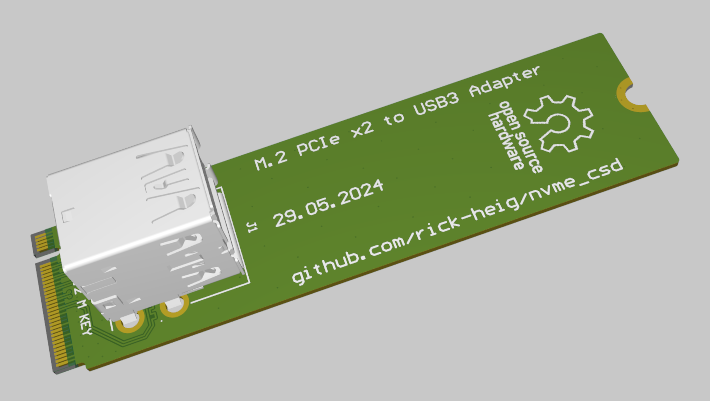
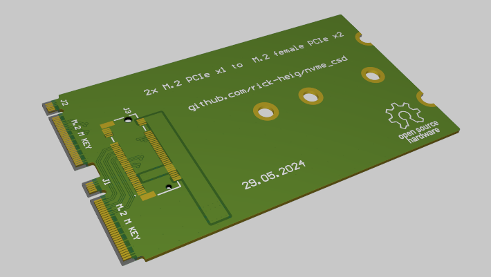
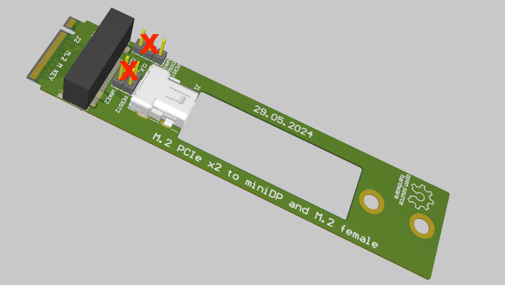
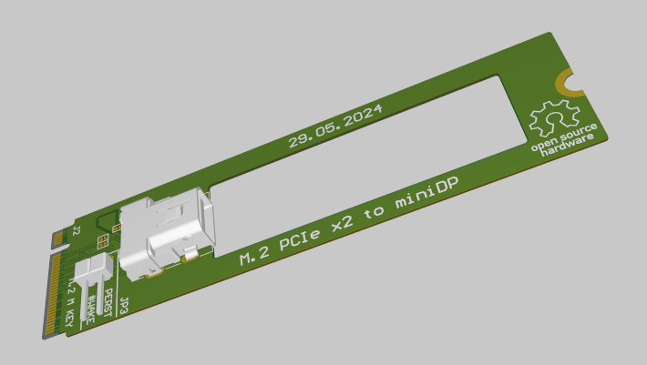

# Printed Circuit Boards

Open-hardware PCBs (Altium)

## M.2 to dual USB3 connector

This PCB is compatible with M.2 x1 riser PCBs

This allow to make a PCIe 3.0 x2 endpoint on the CM3588 + NAS Kit

## Dual M.2 PCIe x1 to x2 Female M.2

This PCB allows to use PCIe 3.0 x2 for a single NVMe SSD on the CM3588 NAS Kit

## x4 M.2 to x2 M.2 and MiniDP

This PCB allows to split a female M.2 PCIe 3.0 x4 into a female M.2 x2 and x2 over mini display port cable. The choice of MiniDP is because the cable has four high-speed differential signals, and differential clock. The small connector size is also a perfect fit.

Note: USB3 has only 2 high speed differential signals, HDMI has only 3. So they can only carry PCIe x1. USB-C could carry PCIe x2 but is not suitable because routing of PERST (PCIe reset) and WAKE signals, which would have to use the auxiliary lines in the USB-C connector, but these lines can be reversed because USB-C can be plugged both ways...

## MiniDP to x2 M.2

This PCB is the other end of the PCB above and allows to get PCIe x2 on a male M.2 connector.