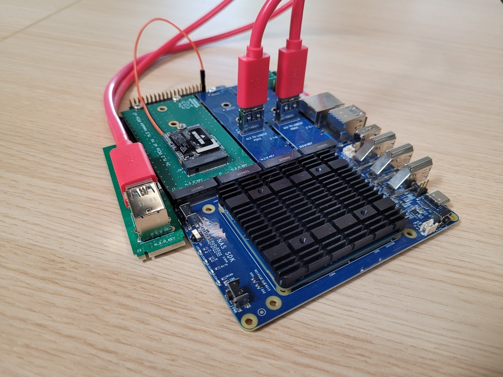
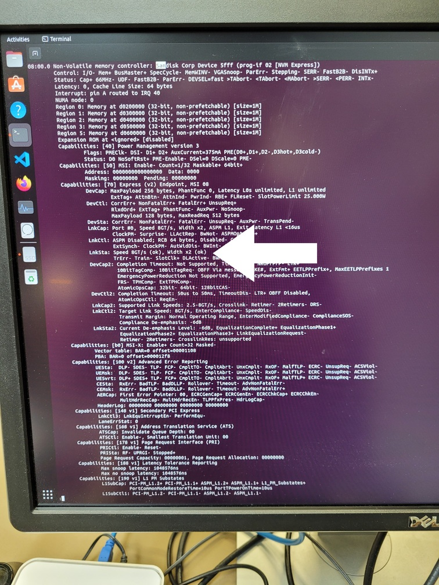
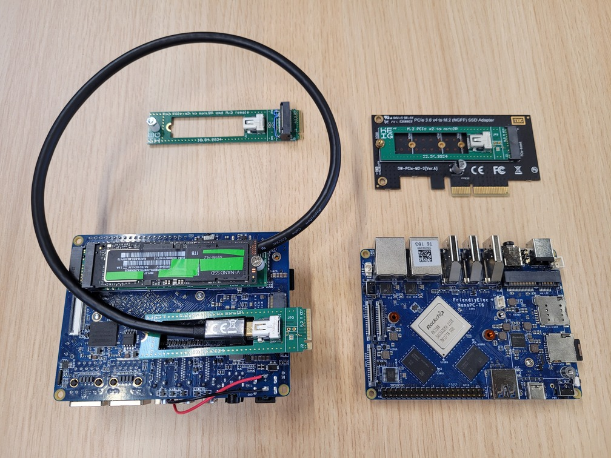

# Printed Circuit Boards

Open-hardware PCBs (Altium)

A million thanks to [Cédric Monneron](https://people.hes-so.ch/en/profile/8414894304-cedric-monneron) who did most of the work for the PCB design.

**Warning:** These PCBs require the PCIe controller and PHYs to be reconfigured to work, they require the device tree to reflect this. For the RK3588 the PHY drivers requires a patch for correct bifurcation of PCIe lines for the x4 to x2 RC + x2 EP.

**Do not use unless you know exactly what you are doing**

## M.2 to dual USB3 connector

This PCB is compatible with M.2 x1 riser PCBs

This allow to make a PCIe 3.0 x2 endpoint on the CM3588 + NAS Kit

## Dual M.2 PCIe x1 to x2 Female M.2

This PCB allows to use PCIe 3.0 x2 for a single NVMe SSD on the CM3588 NAS Kit

### PCBs in use on the CM3588 + NAS Kit

With this the CM3588 NAS Kit can do PCIe 3.0 x2 instead of x1! 

Please ignore the botch wire, we forgot to route a signal on the old revision of the PCB.

The CM3588 + NAS Kit recognized as a PCIe 3.0 x2 NVMe SSD/CSD by the host.

## x4 M.2 to x2 M.2 and MiniDP

This PCB allows to split a female M.2 PCIe 3.0 x4 into a female M.2 x2 and x2 over mini display port cable. The choice of MiniDP is because the cable has four high-speed differential signals, and differential clock. The small connector size is also a perfect fit.

Note: USB3 has only 2 high speed differential signals, HDMI has only 3. So they can only carry PCIe x1. USB-C could carry PCIe x2 but is not suitable because routing of PERST (PCIe reset) and WAKE signals, which would have to use the auxiliary lines in the USB-C connector, but these lines can be reversed because USB-C can be plugged both ways...

## MiniDP to x2 M.2

This PCB is the other end of the PCB above and allows to get PCIe x2 on a male M.2 connector.

### Adapter PCBs mounted on the FriendlyElec NanoPC-T6

