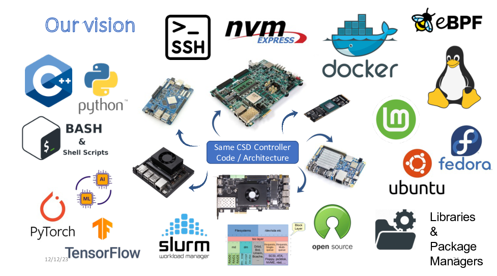

# Platforms

Our vision is to provide a single computational storage firmware and have it run on mutiple hardware platforms without the need to rewrite it. We also want to provide a rich development environment on our computational storage devices to allow for rapide prototyping of complex ideas.

## Currently supported and tested platforms

The following platforms are currently supported and have been tested in this project :

- **Xilinx/AMD** ZCU106 (ZynqUS+) : [zcu106](zcu106) - https://www.xilinx.com/products/boards-and-kits/zcu106.html
- Rockpro64 (RK3399) : [rockpro64](rockpro64) - https://www.pine64.org/rockpro64/
- NanoPC-T4 (RK3399) : [nanopc-t4](nanopc-t4) - https://www.friendlyelec.com/index.php?route=product/product&product_id=225
- **New:** CM3588+NAS Kit : [cm3588](cm3588) - https://www.friendlyelec.com/index.php?route=product/product&product_id=294
- **New:** NanoPC-T6 (RK3588) : [nanopc-t6](nanopc-t6) - https://www.friendlyelec.com/index.php?route=product/product&product_id=292
- **New:** Rock5B (RK3588) : https://radxa.com/products/rock5/5b/

## Other platforms

### Supported but not tested

The following platforms should be supported (non exhaustive list) but were not tested by us :

- **AMD/Xilinx** : All ZynqUS+ with PCIe hardblock based platform should be supported : https://www.xilinx.com/products/silicon-devices/soc/zynq-ultrascale-mpsoc.html (see ZCU106 platform for PCI endpoint driver)
- **AMD/Xilinx** : Any Zynq7000 with PCIe hardblock based platform should be supported : https://www.xilinx.com/products/silicon-devices/soc/zynq-7000.html (see ZCU106 platform for PCI endpoint driver)
- **AMD/Xilinx** : Other FPGA platforms with PCIe hardblock can be supported by running Linux on a MicroBlaze (configured as Application Processor, because it needs an MMU), this would allow to present the FPGA in the [AMD/Xilinx SmartSSD](https://www.xilinx.com/applications/data-center/computational-storage/smartssd.html) as an NVMe CSD, other interesting platforms include M.2 factor Artix7 boards such as https://numato.com/product/aller-artix-7-fpga-board-with-m-2-interface/
- **TI** Jacinto 7 processors : https://software-dl.ti.com/jacinto7/esd/processor-sdk-linux-jacinto7/latest/exports/docs/linux/Foundational_Components/Kernel/Kernel_Drivers/PCIe/PCIe_End_Point.html
- **Nvidia** Jetson Xavier NX, Jetson AGX Xavier, Jetson Orin : https://docs.nvidia.com/jetson/archives/r35.4.1/DeveloperGuide/text/SD/Communications/PcieEndpointMode.html
- Other platforms check drivers in https://elixir.bootlin.com/linux/latest/source/drivers/pci/controller and subdirectories

Note that these platforms are supported but can require some amount of work, e.g., to compile the patched kernel with the NVMe CSD driver and setup the environment, or to setup the hardware project in case of FPGA platforms.

### Hardware supported but missing driver

Any Soc/FPGA capable of running Linux with a PCIe endpoint capable controller IP are suitable canadidate platforms but often a PCI endpoint controller driver is not available.

Non exhaustive list of candidate platforms :

- **Intel/Altera** FPGAs with PCIe could be supported but there is no driver to present the PCIe IP as an endpoint controller to a Linux running inside the device (the available drivers are for the host to use the PCIe FPGAs as a device or use the PCIe IP as a host controller).

## Is my platform compatible ?

It should have the following features :

- It should be able to run Linux
- It should have a PCIe endpoint controller (with driver, check drivers in https://elixir.bootlin.com/linux/latest/source/drivers/pci/controller and subdirectories, or write one https://www.kernel.org/doc/html/latest/PCI/endpoint/pci-endpoint.html#pci-endpoint-core)
- For performance it should have a DMA

Note : For the electrical connection PCIe male/female converters can be used, this allows to use some platforms that were designed to act as PCIe hosts (e.g., with female connectors) but care has to be taken. Tx/Rx lanes should be swapped (in the adapter cable). Power is now supplied to the device and not from the device (split power in adapter). Refclk is now provided to the device and not from the device (either use refclock provided by host if possible or run in separate clock architecture).