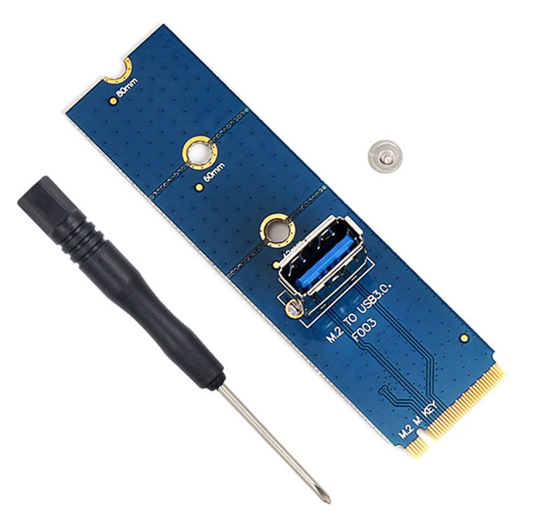

# BeagleY-AI

The BeagleY-AI board is a low-cost, open-hardware, community-supported development platform for developers and hobbyists. The board comes in a RaspberryPi form-factor compatible with numerous accessories. The BeagleY-AI comes with a TI AM67A quad-core 64-bit ARM processor at 1.4 GHz, 4GB of LPDDR4, a dedicated 4 TOPS AI co-processor, and a realtime I/O 800MHz ARM R5 microcontroller.

https://www.beagleboard.org/boards/beagley-ai


# Board information

- CPU: AM67A Quad-core ARM Cortex-A53 at 1.4GHz
- NPU: 4TOPs, Dual general-purpose C7x DSP with Matrix Multiply Accelerator (MMA)
- RAM: 4GB LPDDR4
- PCIe 3.0 x1
- 4x USB3.1 ports
- Gigabit Ethernet and WiFi

PCIe adapter : https://www.amazon.com/Geekworm-X1000-Key-M-Peripheral-Raspberry/dp/B0CQ4D2C9S


As this board has only PCIe x1 you can use two M.2 x1 riser PCBs and an USB3 cable.



# Setting up a development environment

The instructions below are given and tested on an Ubuntu Linux distribution 24.04.

## Setup SD card

Download the BeagleY-AI Debian 12.6 2024-07-11 XFCE image here : https://www.beagleboard.org/distros/beagley-ai-debian-12-6-2024-07-11-xfce

Follow the quick start guide to setup the SD : https://docs.beagle.cc/boards/beagley/ai/02-quick-start.html

Or do it by command line for example :

```shell
xz -d < beagley-ai-debian-12.6-xfce-arm64-2024-07-11-12gb.img.xz - | sudo dd of=/dev/sdX bs=1M status=progress
sudo sync
```

Where `/dev/sdX` is the SD card e.g., `/dev/sdf` or `/dev/mmcblk0`.

Edit the file `sysconf.txt` in the `BOOT` partition of the SD card. Set the user name and password. For more info check : https://docs.beagle.cc/boards/beagley/ai/02-quick-start.html

Your SD card should now be bootable by the BeagleY-AI board.

## Clone the Linux kernel with CSD

```shell
cd nvme_csd/platforms/beagley-ai/work
# Install prerequisite packages
sudo apt update
sudo apt-get install gettext bison flex libmpc-dev u-boot-tools debhelper build-essential
# Clone the kernel repository
git clone -b ti-linux-arm64-6.6.y --single-branch https://github.com/rick-heig/ti-linux-kernel-dev.git
cd ti-linux-kernel-dev
# The script will open the Linux menuconfig, just exit it for now, then build the kernel, can take between 30min-2h
./build_deb.sh
# Apply the CSD related patches with
./apply_csd_patches.sh
```

### Build the new kernel

```shell
# Build the kernel again, this will be fast as only required files are recompiled
./build_deb.sh
# This will generate .deb files in the "deploy" directory
```

### Install the new kernel

Copy these .deb files to the BeagleBoard, for example through SSH

```shell
scp deploy/*.deb <user>@<hostname/IP>:/home/<user>/
```

Where `<user>` is the user chosen above and `<hostname/IP>` is the hostname or IP of the BeagleBoard. You can get the hostname with the `hostname` command and the IP (if needed) with `hostname -I`.

For example :

```shell
scp deploy/*.deb beagle@beaglebone:/home/beagle/
```

And then on the BeagleBoard install the packages with :

```shell
sudo dpkg -i *.deb
# Once installed reboot
sudo reboot
```

Copy the NVMe endpoint function launch script (to launch the CSD), for example through SSH

```shell
scp csd/nvme-epf-script beagle@beaglebone2:/home/beagle/
```

## Making changes to the kernel

When running `./build_deb.sh` you can edit options in the menuconfig.

For further changes and patches to the kernel you can directly edit the files in `KERNEL` and rebuild with `./build_deb.sh` and install as described above.