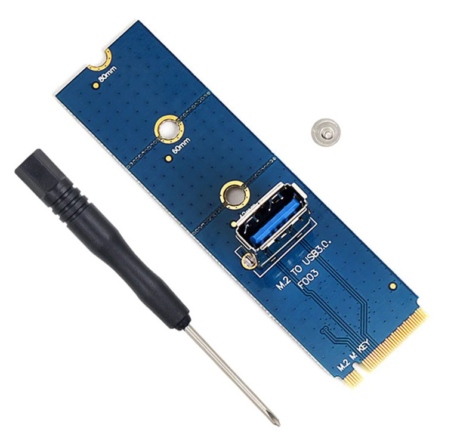
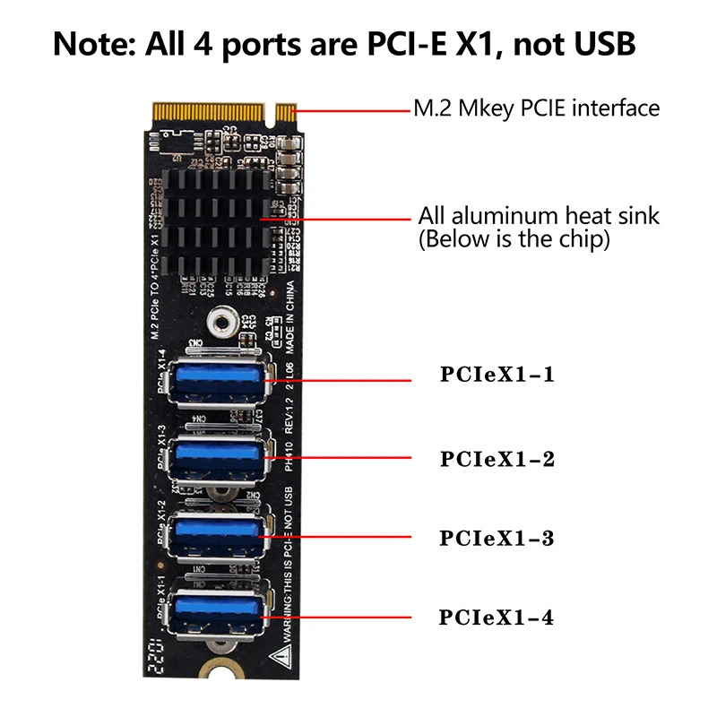

# CM3588 + NAS Kit

The FriendlyElec CM3588 + NAS Kit combines a RK3588 based compute module with a backplane that hosts four M.2 PCIe connectors.


# Board information

- CPU: Quad-core ARM Cortex-A76 (up to 2.4GHz) and quad-core Cortex-A55 CPU (up to 1.8GHz)
- GPU: Mali-G610 MP4, compatible with OpenGLES 1.1, 2.0, and 3.2, OpenCL up to 2.2 and Vulkan1.2
- VPU: 8K@60fps H.265 and VP9 decoder, 8K@30fps H.264 decoder, 4K@60fps AV1 decoder, 8K@30fps H.264 and H.265 encoder
- NPU: 6TOPs, supports INT4/INT8/INT16/FP16
- RAM: 64-bit 4GB/8GB/16GB LPDDR4X at 2133MHz
- Four PCIe M.2 M-Key connectors with PCIe 3.0 x1
- eMMC Flash: 0GB/64GB eMMC, at HS400 mode
- ...

# Setting up a development environment

These are the instructions to setup Linux and the CSD firmware for the FriendlyElec CM3588+NAS kit. The Linux kernel and RootFS are built with buildroot.

Below are the steps to set up an environment that allwos for rapid code changes in the Linux kernel source code directly (without the need to apply patches to a mainline kernel in buildroot).

For the sake of simplicity and make the commands below more uniform we assume that the user is working from the `platforms/cm3588/work` directory.

## Clone the Linux kernel with CSD

First we will need to clone the Linux kernel with CSD firmware, this directory will be passed to buildroot. This will be our working source directory.

```shell
# Clone the repository
git clone https://github.com/rick-heig/linux.git
# Go in the directory
cd linux
# Get the path of directory (used below in buildroot)
CSD_LINUX_PATH=$(realpath .)
# Checkout out the CSD branch
git checkout cm3588_csd_v1
# (Optional) create a new branch to apply new changes
git checkout -b cm3588_csd_custom_v1
# Go back to the "work" directory
cd ..
```

## Clone buildroot and setup

```shell
# Clone the repository
git clone https://github.com/rick-heig/buildroot.git
# Go in the directory
cd buildroot
# Checkout out the CSD branch
git checkout cm3588_csd_v1
# Create the local.mk file with the path to the Linux kernel source
echo "LINUX_OVERRIDE_SRCDIR = ${CSD_LINUX_PATH}" > local.mk
# (Optional) create a new branch to apply new changes
git checkout -b nanopc_t6_csd_custom_v1
```

## Build

In the `work/buildroot` directory

```shell
# Setup the configuration for the board
make friendlyelec_cm3588_nas_ep_defconfig
# Build
make
```

One eternity later...

The output file for the SD card will be located here `work/buildroot/output/images/sdcard.img`

Modifications can be made, both in the `work/linux` folder to make changes to the kernel and drivers and in the `work/buildroot` directory for changes to the RootFS and other parts.

To rebuild call `make` or `make linux-rebuild all` from the `work/buildroot` directory.

## Setup SD card

```shell
# Copy data to the SD card
sudo dd if=output/images/sdcard.img of=/dev/<your SD card device>
# Sync so that the SD can be safely ejected
sudo sync
```

### Resizing the RootFS

**Required for larger OS, e.g., Debian/Ubuntu**

The default RootFS is of very small size (256 MB), but it can be resized to use all of the SD card remaining space. This will be required to install larger RootFS such as an Ubuntu RootFS. To do so follow the instructions below :

```shell
# Make sure the partitions are unmounted
sudo umount /dev/<the SD card device>*
# Open the SD card device with fdisk
sudo fdisk /dev/<the SD card device> # e.g., /dev/sdg
# Print the current partition table with 'p' and note the start sector of the RootFS (last) partition
# Delete the current RootFS partition (it should be partition 2, the last one) with 'd'
# Create a new partition (number 2) with 'n', set the first sector to be exactly the same as it was above and use the default parameters for the size, keep the signature !
# write the changes with 'w'
# Check the filesystem with e2fsck (fix if errors are found)
sudo e2fsck -f /dev/<the SD card device RootFS partition> # e.g., /dev/sdg2
# Resize the RootFS
sudo resize2fs /dev/<the SD card device RootFS partition> # e.g., /dev/sdg2
# Make sure changes are written to SD card with sync
sudo sync
# Eject and remount
# check size with
df -h
```

### Username and password

The default credentials are : username : `buildroot` password `buildroot`

## PCIe cables

For adapters and cables checkout https://blog.reds.ch/?p=1759

As this kit has only PCIe x1 on the M.2 slots, we recommend using M.2 PCIe risers as they are extremely cheap (less than 1$). They can be bought at the usual sources, e.g., aliexpress.



For the host PC it is possible to use an M.2 PCIe switch, this allows to connect up to 4 CSD to a single M.2 slot.



# Setting up Ubuntu (or Debian) on the RockPro64

The minimal RootFS built with buildroot above may not be the most friendly environment for rapid testing and prototyping, especially for user space programs, therefore we show how to install Ubuntu on the RockPro64.

## Prebuilt image

TODO

## Prerequisites

The kernel and U-boot bootloader are required, they are built above with buildroot.

For cross configuring ARM64 packages on a non ARM64 (e.g., AMD64) machine we need emulation. For this we use QEMU transparent emulation. We will also need debootstrap to create the base RootFS.

Install required packages with (for Ubuntu/Debian hosts)

```shell
sudo apt install binfmt-support qemu-user-static debootstrap
```

## Setup

From the `platforms/cm3588/work`directory :

```shell
# in the work directory create a RootFS directory (can be on SD directly)
mkdir rootfs
# Populate RootFS with debootstrap tool (here Ubuntu Mantic is chosen, you chose other versions or Debian)
sudo debootstrap --arch=arm64 mantic rootfs/ http://ports.ubuntu.com/ubuntu-ports/
# Go in the Buildroot Linux build directory
cd buildroot/output/build/linux-custom
# Install the drivers (modules) in the RootFS
sudo ARCH=arm64 CROSS_COMPILE=aarch64-linux-gnu- INSTALL_MOD_PATH=../../../../rootfs/ make modules_install
# Go back to "work" directory
cd ../../../..
# Copy the scripts (to launch the CSD) from the buildroot overlay
sudo cp buildroot/board/friendlyelec/cm3588-nas/overlay/usr/bin/* rootfs/usr/bin/
# git clone firmwares (for network)
git clone https://git.kernel.org/pub/scm/linux/kernel/git/firmware/linux-firmware.git/
# Create firmware directory
sudo mkdir rootfs/lib/firmware
# Copy firmware
sudo cp -r linux-firmware/rtl_nic/ rootfs/lib/firmware/
# Optionnally delete the cloned repo
rm -rf linux-firmware
# Copy QEMU ARM64 emulator (static binary) into the rootfs (install if you don't have it)
# The binary can later be removed, or simply leave it if you want to chroot from host again later
sudo cp $(which qemu-aarch64-static) rootfs/usr/bin/
# Chroot into the rootfs and run the QEMU emulator to run bash
sudo chroot rootfs qemu-aarch64-static /bin/bash
```

### Configuring the Ubuntu RootFS

While being in the RootFS with chroot execute the commands below (ctrl-D to exit). **Warning:** be sure to execute these commands in the `chroot` environment and not on the host computer directly.

```shell
# Set a hostname for the CSD
echo "CSD-CM3588" > /etc/hostname
echo "127.0.0.1 CSD-CM3588" >> /etc/hosts
# Set fstab
echo "/dev/mmcblk1p2	/	ext4	errors=remount-ro	0	1" > /etc/fstab
# Set a new root password
passwd
# Setup networking
systemctl enable systemd-networkd
# Write the networking config below (with vi or other editor)
vi /etc/systemd/network/ethernet.network
# Generate and chose locales for the system (there will be some warnings and takes a while)
dpkg-reconfigure locales
# Add extra packages to package manager source list, add "restricted universe multiverse" after "main"
vi /etc/apt/sources.list
# Add a non root user
adduser ubuntu
# Finally exit the chroot env with "ctrl-D"
```

Config for /etc/systemd/network/ethernet.network (of the embedded RootFS, not the host computer !) :

```
[Match]
Name=enP4p65s0

[Network]
DHCP=yes
```

Note this is for the leftmost ethernet port, you can create a similar config for the other port by using the name `enP2p33s0` (You can create 2 files, one for each interface).

Note that this config can also be written in the rootfs from outside the `chroot` environment.

Finally copy the files to the SD card RootFS partition (make sure it is big enough, check above on how to resize).

```shell
# Delete old files from (buildroot) RootFS
sudo rm -rf /media/<your user>/rootfs/*
# Copy all Ubuntu RootFS files (the 'p' option is for keep permissions, e.g., owner etc.)
sudo cp -rp /path_to/nvme_csd/platforms/cm3588/work/rootfs/* /media/<your user>/rootfs/
# Sync to make sure data is written to SD in order to safely eject
sudo sync
```

Your SD card is now ready and holds an Ubuntu OS.

# Updating the Linux kernel

Make your changes in the Linux source and rebuild with buildroot with `make linux-rebuild all` (it will be quite fast if the kernel was already built once). If you want to change the config of the kernel use `make linux-menuconfig` from the buildroot directory.

Once everything is built with buildroot you can copy the kernel `Image` from `output/images/` to the boot partition of the SD card (the one that has the `extlinux` folder, `Image` and `.dtb` device tree blob). If changes were made to the device tree, the `.dtb` should also be updated similarly.

If changes were made to modules (drivers), or if module parameters were changed, or if git revision or version of kernel changed, the newly compiled modules should be installed to the RootFS.

**The NVMe CSD firmware is a kernel module so it needs to be reinstalled if changed**.

This can be done from the `work/buildroot/output/build/linux-custom` directory.

```shell
# Please adapt the path to the RootFS on the SD card
sudo ARCH=arm64 CROSS_COMPILE=aarch64-linux-gnu- INSTALL_MOD_PATH=/path/to/sd/rootfs/ make modules_install
```