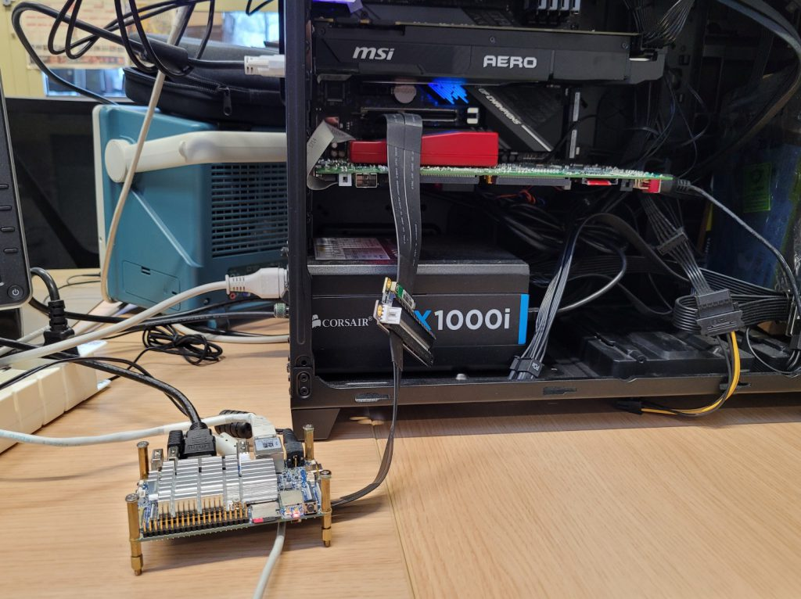

# NanoPC-T4

The [FriendlyElec NanoPC-T4](https://www.friendlyelec.com/index.php?route=product/product&product_id=225) is an ARM RK3399 based single board computer which can act as a platform for the NVMe CSD.

We recommend the [RockPro64](../rockpro64/README.md) as it is less expensive and is based on the same SoC, also the female PCIe connector is easier to work with than the M.2 connector of the T4.

## Build instructions

TODO